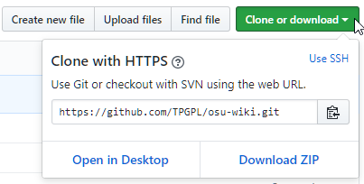
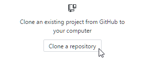
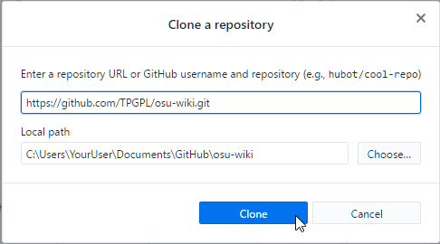
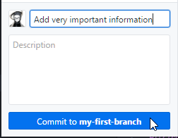
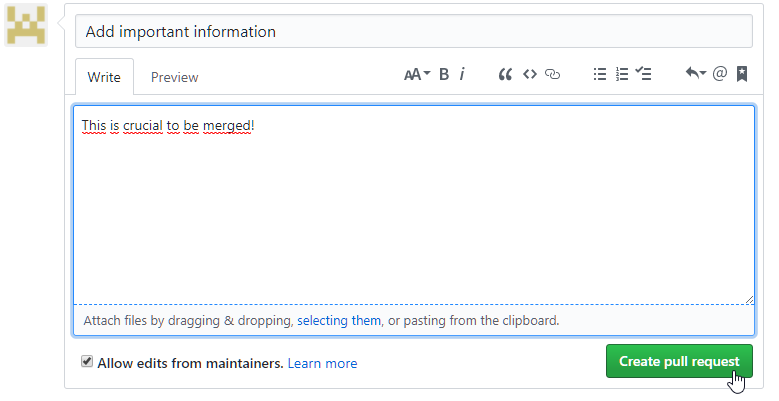

osu!wiki Contribution Guide
========================

This quick-start guide is intended for newcomers that have never worked with GitHub and the wiki contribution workflow before. If you already have experience using GitHub, feel free to skip this guide and follow the common feature-branch workflow for content updates in this repository.

## Preparations

1. [Sign up a GitHub account](https://github.com/join?source=header-home) if you do not have one already.
2. Fork the osu-wiki repository. This creates your very own copy of the osu!wiki files that you can edit freely without worries.
    - Go to the [osu-wiki repository page](https://github.com/ppy/osu-wiki) and click `Fork` in the upper-right corner of the page and wait until it is finished. You will then be led to the page of your forked repository.

      

3. [Download and install GitHub Desktop](https://desktop.github.com) or another tool to use Git. This guide leads you through the workflow with GitHub Desktop only though.
4. Run GitHub Desktop and sign in to GitHub.com after installation.
5. Clone your forked repository to your local PC. For that, go to the page of your forked repository and click the green `Clone or download` button. Copy the shown URL from it and use it

    

    

    

    

## How to use GitHub Desktop

Before working on the osu!wiki files, make sure that the files you work on are up-to-date. Working on outdated files will lead to *conflicts* and your work might be futile.

To keep your fork updated, do the following:

1. Go to the GitHub Desktop client while you have your forked repository opened
2. Click `Repository` on the menu header, then `Open command prompt`. A black command prompt window should open.
3. If you do this for the first time, enter `git remote add upstream https://github.com/ppy/osu-wiki.git` into the command prompt. This step can be skipped in future updates.

  

4. To update your forked repository, enter `git pull upstream master` into the command prompt.

  

Now you can **start working on the osu!wiki files**. For that, go to the folder you specified when cloning the forked repository. There you will find all articles and files that are used in the osu!wiki. Use any editor of your choice to make the changes you desire. Keep in mind that the osu!wiki uses [GitHub Flavored Markdown](https://guides.github.com/features/mastering-markdown/) for formatting purposes. Make sure to follow the [Article Style Guide](/wiki/Article_Style_Guide) when making changes.

In order to distribute your changes, do the following:

1. Save the files you made changes at.
2. Go to the GitHub Desktop client. You will notice that your changes are visible.

  

3. Fill the `Summary` text field with a short description of what you have changed. Make sure to commit regularly and in reasonable portions.
4. Then commit your changes. You may use the `master` branch of your forked repository, but if you are advanced and want to work at multiple things on the same time, you may use [Branches](https://guides.github.com/introduction/flow/) in your own repository.

  

5. Once done will all the changes, *push* all changes to your forked repository by pressing the `Push origin` button.

  

## How to request your changes to be amended

In order to get your changes into the official osu!wiki itself, it is required to create *Pull Requests* from your forked repository into the original one. This is nothing more but a request to check your changes and take them over into the official version of the wiki. Your changes will then be reviewed and eventually amended or rejected.

1. Go to the page of your forked repository and click `New Pull Request`.

  

2. Click the green `Create pull request` button in the yellow box.

  

3. Give your *Pull Request* a proper title and a description. Then click `Create pull request`. This will open the Pull Request and lead you to the page of it. Other contributors can now comment and review these changes.

  

4. You can find yours or other people's Pull Requests at the [osu-wiki repository](https://github.com/ppy/osu-wiki/pulls).

If you are asked to make changes to your work, you can commit them normally and your Pull Request will be automatically be updated.

We hope this briefs you on how to contribute to the new osu!wiki. If you have any questions, you can inquire at the [osu!dev Discord Server](https://discord.gg/ppy).
